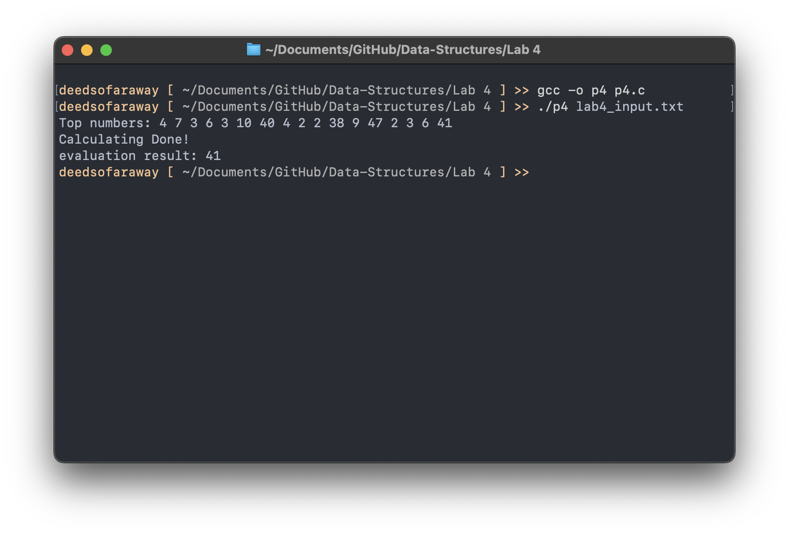

# Lab 4: Stack Implementation in C

💡 This documentation outlines a basic stack implementation in C. The code includes essential stack operations such as push, pop, and auxiliary functions for stack management and evaluation of postfix expressions.


###### The stack is **implemented using a dynamic array**, allowing it to store a variable number of integers up to a maximum size defined at the creation of the stack instance.

## **Data Structure**
```c
typedef struct Stack {
    int* key;            // Dynamic array to store stack elements
    int top;             // Index of the top element in the stack
    int max_stack_size;  // Maximum capacity of the stack
} Stack;
```

## **Core Functions**

#### CreateStack
Initializes a new stack with a specified maximum size. It allocates memory for the stack structure and its dynamic array.

```c
Stack* CreateStack(int max) {
    Stack* s = (Stack*)malloc(sizeof(Stack)); // Allocate memory for the stack structure
    if (!s || !(s->key = (int*)malloc(max * sizeof(int)))) { // Check for successful memory allocation
        printf("Memory allocation failed\n");
        return NULL;
    }
    s->top = -1; // Set the top to -1 indicating an empty stack
    s->max_stack_size = max; // Set the maximum capacity of the stack
    return s;
}
```

#### Push
Adds a new element x to the top of the stack s. If the stack is full, it prints an overflow message.

```c
void Push(Stack* s, int x) {
    if(IsFull(s)) {
        printf("Stack Overflow\n"); // Check for stack overflow
        return;
    }
    s->key[++s->top] = x; // Increment top and add new element
}
```


#### Pop
Removes and returns the top element of the stack. It decrements the top index after returning the top element, adhering to the LIFO principle.

```c
int Pop(Stack* s) {
    if(s->top == -1) {
        printf("Stack Underflow\n"); // Check for stack underflow
        return -1; // Indicate error with -1
    }
    return s->key[s->top--]; // Return top element and decrement top
}
```


#### Top
Provides a peek at the top element without removing it. This function is useful for evaluating the current state of the stack without altering its content.

```c
int Top(Stack* s) {
    if(IsEmpty(s)) {
        printf("Stack is empty\n"); // Ensure stack is not empty
        return -1;
    }
    return s->key[s->top]; // Return the top element
}
```

#### DeleteStack
Ensures graceful cleanup of the stack by freeing the allocated memory for the dynamic array and the stack structure, thereby avoiding memory leaks.

```c
void DeleteStack(Stack* s) {
    free(s->key); // Free the dynamic array
    free(s); // Free the stack structure
}
```

## Utility Functions

#### IsEmpty
Checks whether the stack is empty. This is determined by checking if the top index is -1.

```c
int IsEmpty(Stack* s) {
    return s->top == -1; // True if top is -1
}
```

#### IsFull
Determines if the stack has reached its maximum capacity. This is essential for avoiding overflow when pushing new elements.

```c
int IsFull(Stack* s) {
    return s->top == s->max_stack_size - 1; // True if top is at the last possible index
}
```

#### Postfix()
Facilitates the evaluation of postfix expressions. It pushes operands onto the stack and applies operators to the operands, effectively reducing the expression step by step until the final result is achieved.

```c
void Postfix(Stack* s, char input) {
    if(input >= '0' && input <= '9') { 
        Push(s, input - '0');
    } else {
        int operand2 = Pop(s);
        int operand1 = Pop(s);
        // Check for errors from Pop before proceeding
        if(operand1 == -1 || operand2 == -1) {
            printf("Error in operands\n");
            return; // Early return to avoid further calculation
        }
        switch(input) {
        case '+': Push(s, operand1 + operand2); break;
        case '-': Push(s, operand1 - operand2); break;
        case '*': Push(s, operand1 * operand2); break;
        case '/': if(operand2 == 0) {printf("Division by zero\n");} else {Push(s, operand1 / operand2);} break;
        case '%': if(operand2 == 0) {printf("Division by zero\n");} else {Push(s, operand1 % operand2);} break;
        default: printf("Invalid Operator!\n");
        }
    }
}
```

## Input .txt file

```
4736%+*42/-9+23*-!
```
## Output

