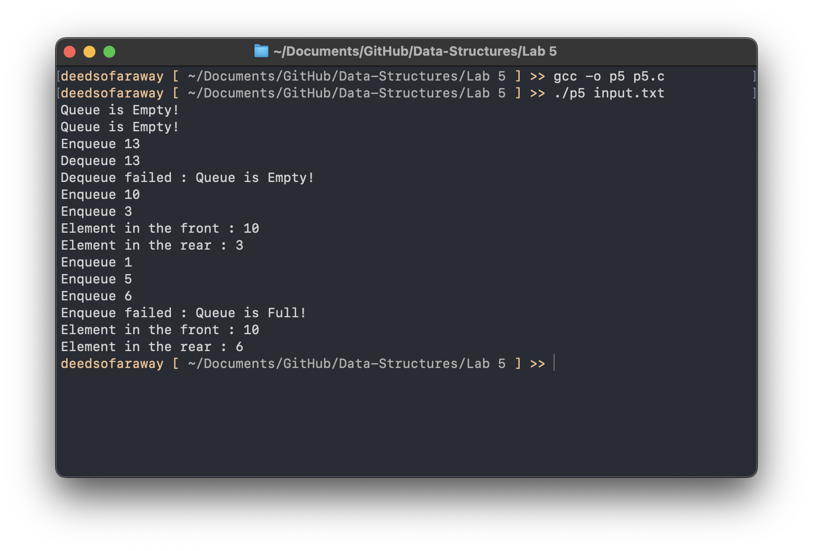

# Lab 5: Circular Queue Implementation in C

💡 This documentation provides insights into a circular queue implementation in C. It encompasses essential operations such as enqueue and dequeue, alongside utility functions for initializing the queue, checking its state (empty or full), and managing elements.


###### A circular queue is a linear data structure that uses a single, fixed-size buffer as if it were connected end-to-end. This setup allows the circular queue to **efficiently utilize space by overwriting old elements with new ones in a cyclic manner**.

## **Data Structure**
The foundation of the circular queue is the **`CircularQueueStruct`** structure, containing an array for the queue elements (**`key`**), integers to track the front and rear indexes, the current size of the queue (**`size`**), and its maximum capacity (**`max_queue_size`**`). 

Note that **`CircularQueue`** itself is a pointer and it's poining to the struct **`CircularQueueStruct`**.

```c
struct CircularQueueStruct {
    int* key;            // Dynamic array for storing queue elements
    int front;           // Index of the front element
    int rear;            // Index of the rear element
    int size;            // Current number of elements in the queue
    int max_queue_size;  // Maximum capacity of the queue
};

typedef struct CircularQueueStruct* CircularQueue;

```

## **Core Functions**

#### MakeEmpty
Initializes a new circular queue with a specified maximum size. It allocates memory for the queue structure and its array of elements.

```c
CircularQueue MakeEmpty(int max) {
    CircularQueue queue = malloc(sizeof(struct CircularQueueStruct)); // Allocate memory for the queue
    if (!queue || !(queue->key = (int*)malloc(max * sizeof(int)))) {
        printf("Memory allocation failed\n"); // Check for allocation success
        return NULL;
    }
    queue->size = 0;
    queue->max_queue_size = max;
    queue->front = 1; // Set front to 1, optimizing space usage
    queue->rear = 0; // Start rear at 0

    return queue;
}
```

#### IsEmpty
Checks if the circular queue is empty by comparing its size to 0.

```c
int IsEmpty(CircularQueue Q) {
    return (Q->size == 0);
}
```


#### IsFull
Determines if the circular queue has reached its maximum capacity by comparing its size to the maximum queue size.

```c
int IsFull(CircularQueue Q) {
    return (Q->size == Q->max_queue_size);
}
```


#### Enqueue
Adds a new element **`x`** to the rear of the queue. If the queue is full, it indicates an overflow condition.

```c
void Enqueue(CircularQueue Q, int x) {
    if (IsFull(Q)) {
        printf("Enqueue failed : Queue is Full!\n"); // Check for full queue
        return;
    } else {
        Q->size++; // Increment size
        Q->rear = ((Q->rear + 1) % Q->max_queue_size); // Circular increment of rear
        Q->key[Q->rear] = x; // Insert element at the new rear position
        printf("Enqueue %d\n", x);
    }
}
```

#### Dequeue
Removes and returns the element at the front of the queue. If the queue is empty, it indicates an underflow condition.

```c
void Dequeue(CircularQueue Q) {
    if (IsEmpty(Q)) {
        printf("Dequeue failed : Queue is Empty!\n");
        return;
    } else {
        int y = Q->key[Q->front]; // Retrieve the front element
        Q->front = (Q->front + 1) % Q->max_queue_size; // Circular increment of front
        printf("Dequeue %d\n", y);
        Q->size--; // Decrement size
    }
}
```

#### PrintFirst & PrintRear
Utility functions to print the element at the front and the rear of the queue, respectively. They handle cases where the queue is empty.

```c
void PrintFirst(CircularQueue Q) {
    if (IsEmpty(Q)) {
        printf("Queue is Empty!\n");
    } else {
        printf("Element in the front : %d\n", Q->key[Q->front]);
    }
}

void PrintRear(CircularQueue Q) {
    if (IsEmpty(Q)) {
        printf("Queue is Empty!\n");
    } else {
        printf("Element in the rear : %d\n", Q->key[Q->rear]);
    }
}
```

#### DeleteQueue
Frees the memory allocated for the queue's array and the queue structure itself, effectively preventing memory leaks.

```c
void DeleteQueue(CircularQueue Q) {
    free(Q->key); // Free the dynamic array
    free(Q); // Free the queue structure
}
```


#### Postfix()
Facilitates the evaluation of postfix expressions. It pushes operands onto the stack and applies operators to the operands, effectively reducing the expression step by step until the final result is achieved.

## Input .txt file

```
n 5
f
r
e 13
d
d
e 10
e 3
f
r
e 1
e 5
e 6
e 15
f
r
```
## Output

